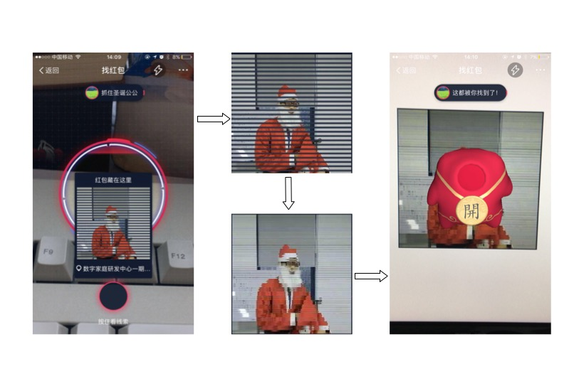

# 支付宝 AR 红包

来不及解释了，快点 Star。【其实，我只想静静地坐在电脑前刷红包……

## 原理

用手机查看支付宝 AR 红包的线索时可以发现，线索图片被一些灰色线条遮挡住。如果将灰色线条去掉，是否就可以扫描出红包呢？

## 示例

先在支付宝客户端 AR 红包界面截图，然后在裁剪**线索图片**，接着处理灰色线条，最后在电脑上打开图片用支付宝扫一扫。

## 体验

示例代码是一个简单的 python 脚本，依赖 Pillow 和 Numpy，如果不想动手，可以直接微信关注：

发送 **裁剪** 后的图片，即可自动生成处理后的结果。
